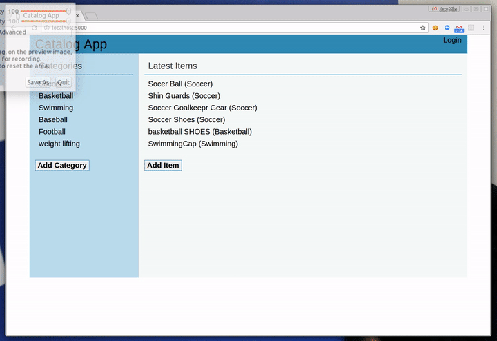
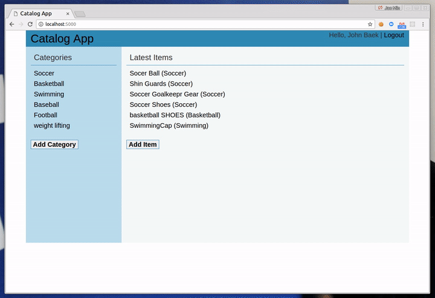
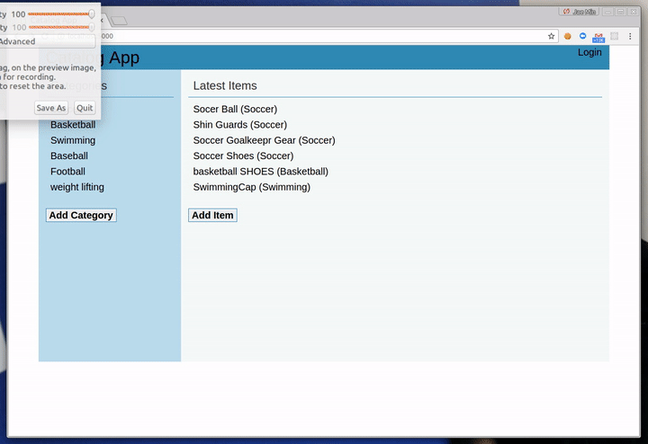

Catalog App
=============
Catalog App is a RESTful web application using the Python framework 'Flask' along with implementing third-party OAuth authentication. 
I Learned when to properly use the various HTTP methods available and how these methods relate to CRUD (create, read, update and delete) operations.

## Key Feature
#### Login with Google or Facebook


#### Add Item


#### Retrieve JSON data


## Setup (Essential before running the server)
1. install [Vagrant](https://www.vagrantup.com/) and [VirtualBox](https://www.virtualbox.org/wiki/Downloads?replytocom=98578)

2. install the appropriate version of package by typing things below on your terminal
```
$ pip install werkzeug==0.8.3
$ pip install flask==0.9
$ pip install Flask-Login==0.1.3
```

## Run 
1. clone the whole file

2. navigate to the folder which contains the file

3. Open your terminal in the folder and type below 
```
$ cd vagrant
$ vagrant up
$ vagrant ssh"
$ cd /vagrant/item/project.py
```
6. set up your database by typing "python db_setup.py"

7. run your localhost by typing "python project.py"

8. open your browser and go to "http://localhost:5000/"
